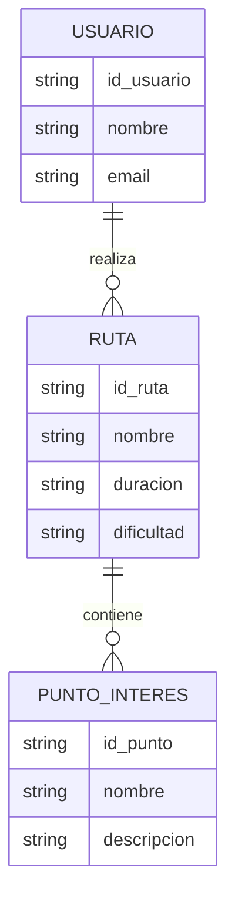
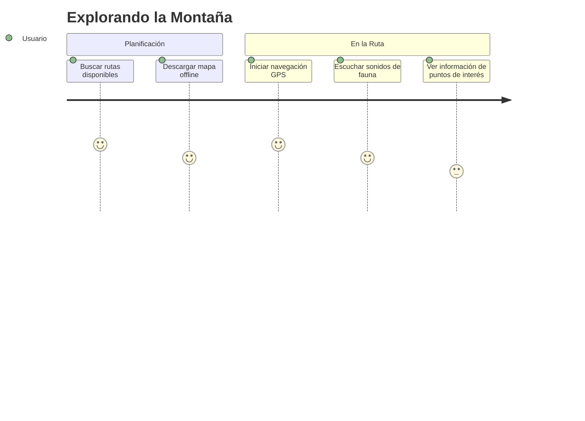
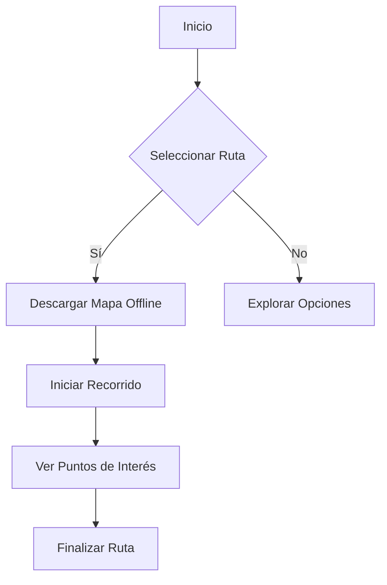

# 

<u>¡Guía digital de senderismo!</u>
<pre></pre>

## 📌 Índice
1. [Sobre el Proyecto](#-sobre-el-proyecto)
2. [Objetivos](#-objetivos)
3. [Tecnologías Utilizadas](#-tecnologías-utilizadas)
4. [Recursos necesarios](#-recursos-necesarios)
4. [Funcionamiento](#-funcionamiento)
5. [Información de interés](#-información-de-interés)

***

## 🚀 Sobre el Proyecto
En este proyecto, hemos trabajado para desarrollar una aplicación móvil que sirva como una ***guía digital para rutas de senderismo***. Nuestra aplicación funciona como un mapa digital y proporciona datos de interés sobre el entorno natural. 

### <u>¿Por qué esta app?</u>
Con esta guía de senderismo digital queremos ***propulsar el turismo de nuestra región*** además de concienciar a las personas a ***preservar el entorno natural*** a través del conocimiento del mismo.

>
 La naturaleza no es un lugar para visitar. Es el hogar. -- Gary Sherman Snyder

En esta primera versión de la aplicación nos centraremos en rutas por la zona de Huesca, pero se planea añadir otras rutas y regiones.

## 🎯 Objetivos
- **Desarrollar una aplicación móvil** que funcione sin conexión a internet.
- **Incluir un buscador de rutas** con información relevante (_duración, longitud, desnivel, dificultad, clima, etc._).
- **Implementar navegación GPS offline** con mapas descargables y seguimiento en tiempo real.
- **Ofrecer información sobre flora, fauna y lugares históricos cercanos.**
- **Incorporar sonidos de animales** que se pueden escuchar en la ruta.
- **Crear un sistema de gestión de usuarios** para registrar rutas completadas y planificar futuras aventuras.
- **Integrar funcionalidades opcionales online** como consulta del clima y reconocimiento de flora.

## 🛠️ Tecnologías Utilizadas

## 🔧 Recursos Necesarios

| Tecnología              | Herramienta/Framework  |
|-------------------------|------------------------|
| Lenguaje                | Kotlin                 |
| IDE                     | Android Studio         |
| Base de Datos           | SQLite con Room        |
|                         |                        |
| Mapas Offline           | MapLibre / Mapsforge   |
| Reconocimiento de Flora | PlantNet API           |

## 📍 Funcionamiento
### Diagrama entidad relación

### Ejemplo de Ruta en la Aplicación

### Diagrama de flujo

## 🔍 Información de interés
📧 <i.latorre@gmail.com>

🌐 [Turismo en Huesca](https://www.huesca.es/w/oficina-de-turismo)

---
🚶‍♂️🌲 ¡Explora, descubre y disfruta de la naturaleza con nuestra app de senderismo! 🌿🌄

---

